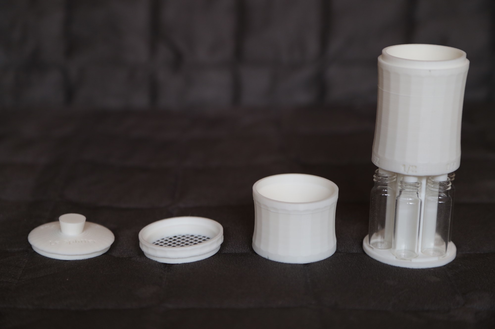
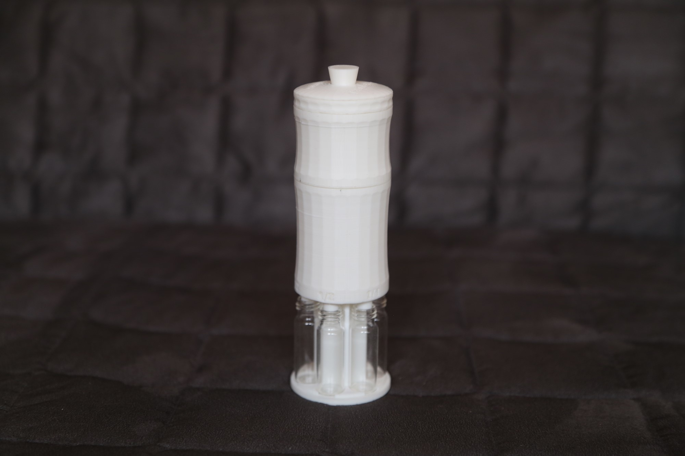
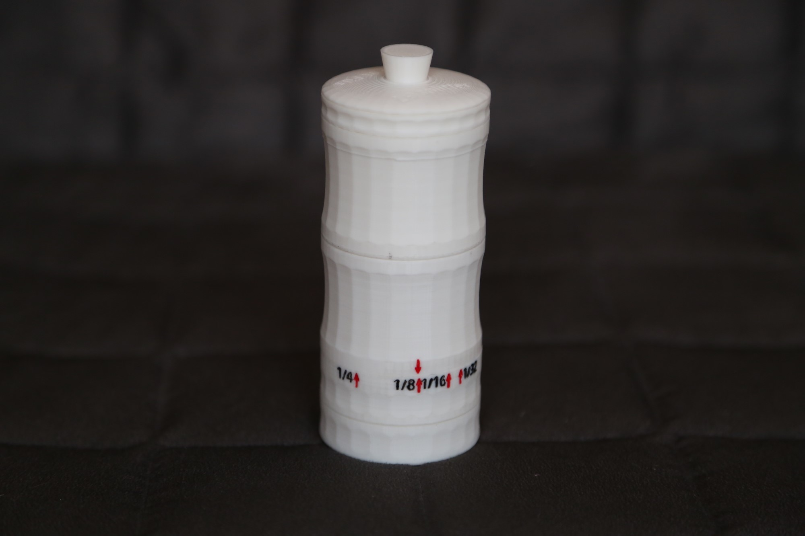

## UPDATE: If you don't own a 3D printer, splitters can be printed on demand.
You can contact us at tetard.martin@gmail.com for more information and visit https://micropalprinter.wordpress.com to see our products!

# Sediment Splitters

This repository contains the design files for two new dry sediment splitters which can be used in micropalaeontological studies for sample fractionation.

The first model (adjustable) provides a single aliquot, adjustable from 1/2 to 1/32 fraction, and the second (fixed) model provides multiple aliquots of different sizes in separate vials.

The two designs as well as some extra parts (accessories) can be easily 3D printed (recommended resolution: 0.10 mm).

A detailed presentation and accuracy tests were published in: https://www.sciencedirect.com/science/article/pii/S0377839819300908?via%3Dihub

More information and images can be found at: https://theguyonhismicroscope.wordpress.com/3d-sediment-splitters/

## Adjustable Splitter

Click on the image above to see the instruction video.

## Fixed Splitter

Click on the image above to see the instruction video.

## UPDATE: If you don't own a 3D printer, splitters can be printed on demand.
You can contact us at tetard.martin@gmail.com for more information and visit https://micropalprinter.wordpress.com to see our products!
