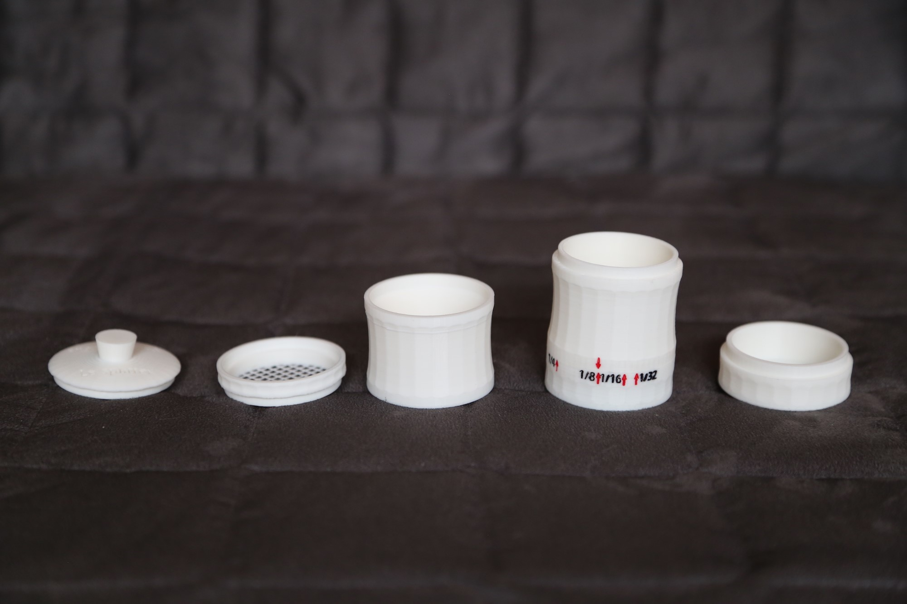

# Sediment Splitters

This repository contains the design files for two new dry sediment splitters which can be used in micropalaeontological studies for sample fractionation.

The first model (adjustable) provides a single aliquot, adjustable from 1/2 to 1/32 fraction, and the second (fixed) model provides multiple aliquots of different sizes in separate vials.

The two designs as well as some extra parts (accessories) can be easily 3D printed (recommended resolution: 0.10 mm)

## Adjustable Splitter

## Fixed Splitter

